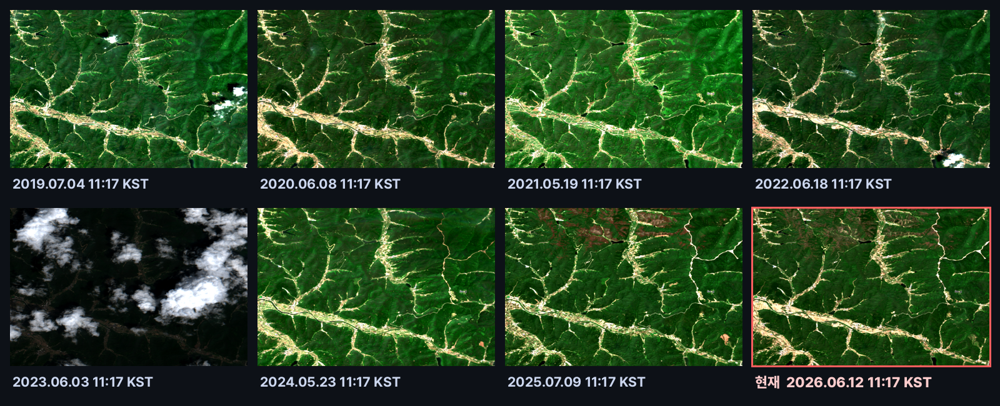
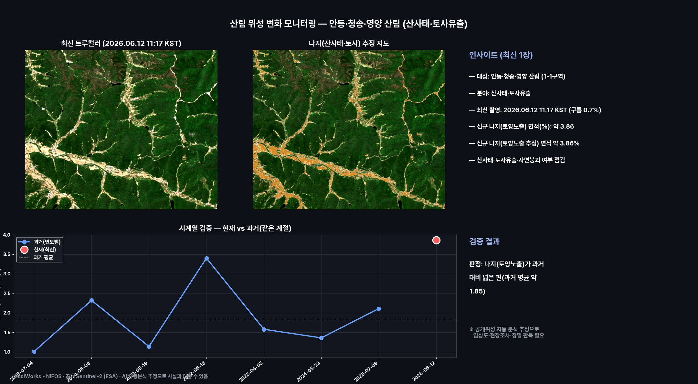
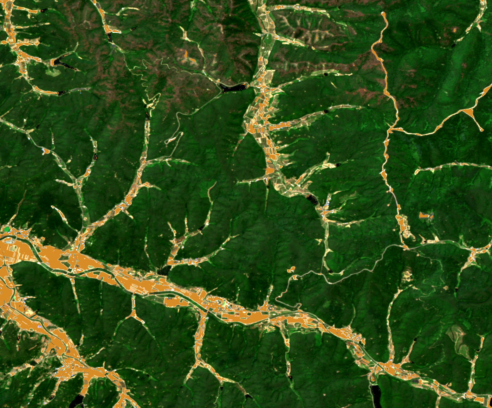
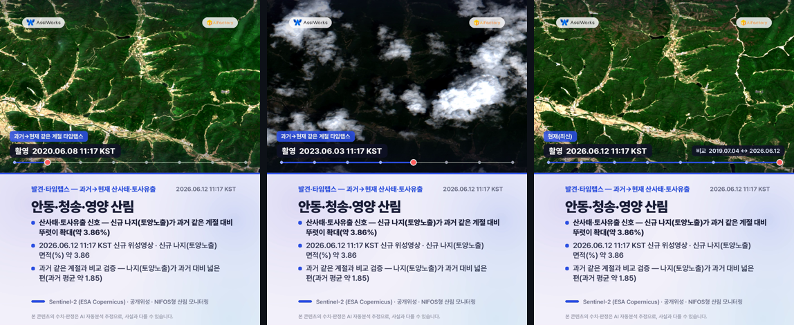
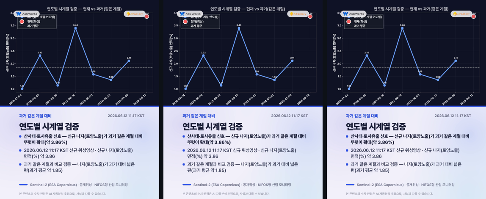
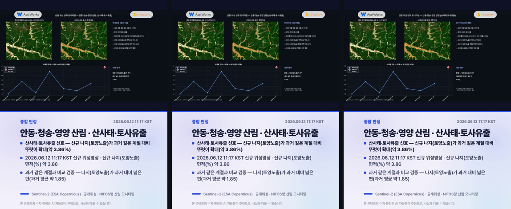

# 산림 위성 변화 모니터링 — 안동·청송·영양 산림 (산사태·토사유출)

**발행**: 2026-06-21 02시 · **분야**: 산사태·토사유출 · **센서**: Sentinel-2 L2A (ESA) · 10 m · **공개위성**
**대상**: 안동·청송·영양 산림 1-1구역 · 경북 내륙 산불 빈발 권역
**원본 촬영**: 2026.06.12 11:17 KST (구름 0.7%, 신규 위성영상) · **분석창**: 중심(36.3239, 128.7935) ±4.0km

> ⚠️ **추정치·공개위성 안내**: 본 콘텐츠는 공개된 Sentinel-2(ESA Copernicus) 위성영상을 AI·알고리즘이 자동 분석한 **추정 결과**로, 사실과 다를 수 있습니다. Sentinel-2(10m)는 국립산림과학원 농림위성(5m, Red-Edge·NIR)의 공개 프록시로 사용한 참고용이며, 산불은 실시간 화점이 아니라 **산불 이후 피해지·식생손실** 탐지입니다. 모든 판정은 임상도·국가산림자원조사·현장조사·정밀 판독을 대체하지 않습니다.

---

## 핵심 발견
> **산사태·토사유출 신호 — 신규 나지(토양노출)가 과거 같은 계절 대비 뚜렷이 확대(약 3.86%)**

## 1단계 — 발견 (최신 1장)
- 2026.06.12 11:17 KST 촬영 영상이 안동·청송·영양 산림 1-1구역에 걸쳐, 분석창 안에서 산사태·토사유출(신규 나지(토양노출) 면적(%))을(를) 분석했습니다.
- 신규 나지(토양노출) 면적(%): 약 3.86.
- 신규 나지(토양노출 추정) 면적 약 3.86%
- 산사태·토사유출·사면붕괴 여부 점검

## 2단계 — 시계열 검증 (같은 계절·연도별)
같은 타일의 과거 같은 계절 청천 영상(7개)과 비교해 검증합니다.
- 과거: 07-04 1.01, 06-08 2.32, 05-19 1.14, 06-18 3.4, 06-03 1.58, 05-23 1.36, 07-09 2.11
- 현재: 06-12 약 3.86
- **판정: 나지(토양노출)가 과거 대비 넓은 편(과거 평균 약 1.85)**
- ※ 공개위성 자동 분석 추정으로 임상도·현장조사·정밀 판독이 필요합니다.

## 과거→현재 같은 계절 영상 (연도별 · 촬영시각 표기)
리포트에서 바로 과거 영상을 확인할 수 있습니다. 각 영상에 촬영 시각(KST)이 표기되며, 빨간 테두리가 현재(최신) 영상입니다.

## 분석 종합 (발견 + 검증)

## 나지(산사태·토사) 추정 지도

## 영상카드 (미리보기)

_아래는 각 영상의 대표 장면입니다. 영상은 링크에서 재생/다운로드._

▶️ [card1_discovery.mp4 영상 보기](videocards/card1_discovery.mp4)

▶️ [card2_timeseries.mp4 영상 보기](videocards/card2_timeseries.mp4)

▶️ [card3_summary.mp4 영상 보기](videocards/card3_summary.mp4)

---
_AssiWorks - NIFOS · 2026-06-21 02시 · 공개 Sentinel-2 (ESA) · 국립산림과학원형 산림 모니터링_
