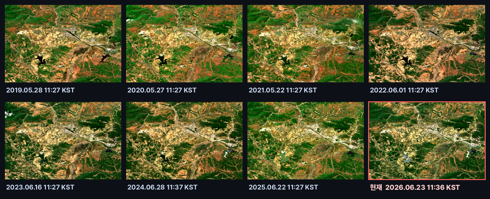
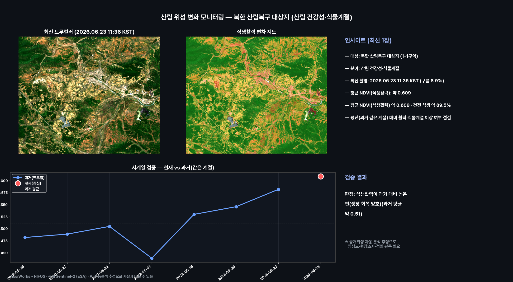
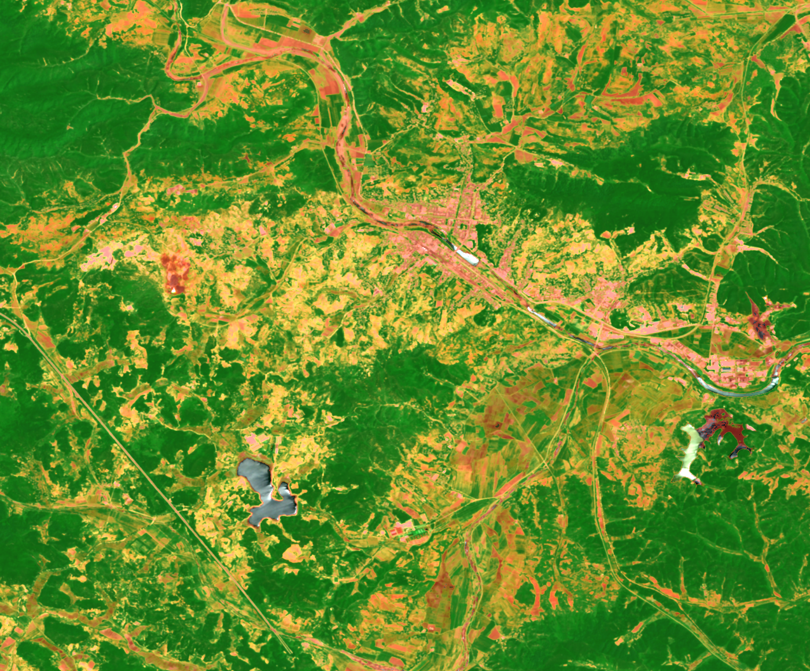
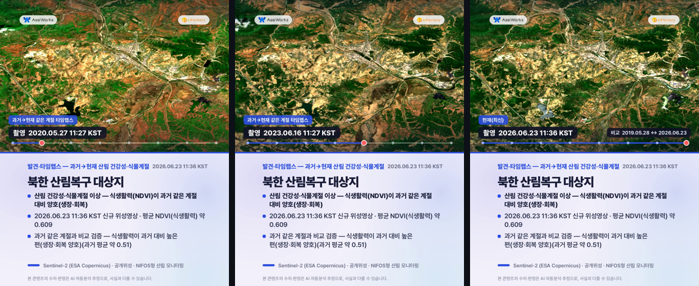
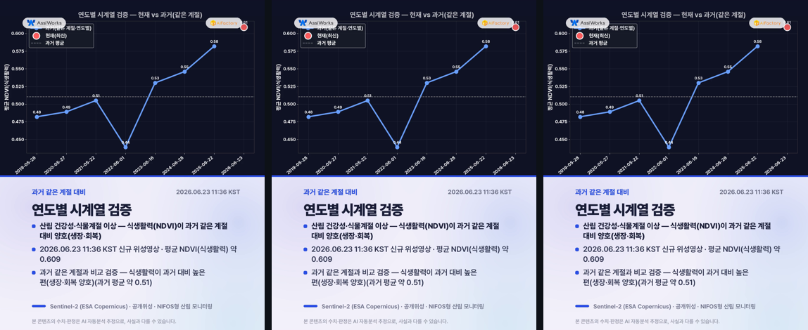
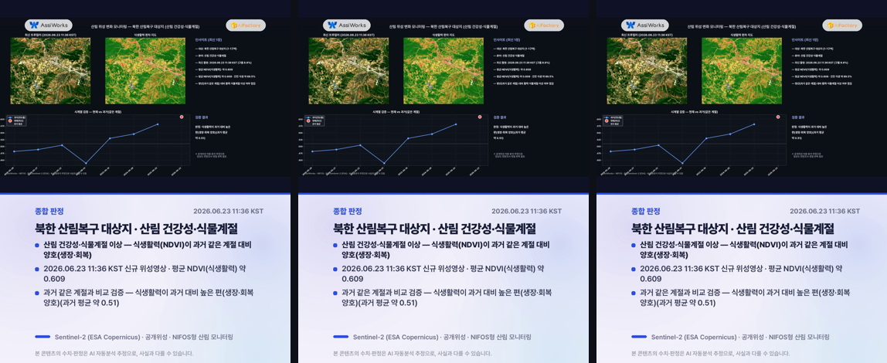

# 산림 위성 변화 모니터링 — 북한 산림복구 대상지 (산림 건강성·식물계절)

**카테고리**: 북한산림 · **발행**: 2026-06-23 14시 · **분야**: 산림 건강성·식물계절 · **센서**: Sentinel-2 L2A (ESA) · 10 m · **공개위성**
**대상**: 북한 산림복구 대상지 1-1구역 · 임진강 북측 유역 — 황폐지·복구대상지(공개 위성), 식생 회복 추적
**원본 촬영**: 2026.06.23 11:36 KST (구름 8.9%, 신규 위성영상) · **분석창**: 중심(38.3239, 126.3892) ±4.5km

> ⚠️ **추정치·공개위성 안내**: 본 콘텐츠는 공개된 Sentinel-2(ESA Copernicus) 위성영상을 AI·알고리즘이 자동 분석한 **추정 결과**로, 사실과 다를 수 있습니다. Sentinel-2(10m)는 국립산림과학원 농림위성(5m, Red-Edge·NIR)의 공개 프록시로 사용한 참고용이며, 산불은 실시간 화점이 아니라 **산불 이후 피해지·식생손실** 탐지입니다. 모든 판정은 임상도·국가산림자원조사·현장조사·정밀 판독을 대체하지 않습니다.

---

## 핵심 발견
> **산림 건강성·식물계절 이상 — 식생활력(NDVI)이 과거 같은 계절 대비 양호(생장·회복)**

## 1단계 — 발견 (최신 1장)
- 2026.06.23 11:36 KST 촬영 영상이 북한 산림복구 대상지 1-1구역에 걸쳐, 분석창 안에서 산림 건강성·식물계절(평균 NDVI(식생활력))을(를) 분석했습니다.
- 평균 NDVI(식생활력): 약 0.609.
- 평균 NDVI(식생활력) 약 0.609 · 건전 식생 약 89.5%
- 평년(과거 같은 계절) 대비 활력·식물계절 이상 여부 점검

## 2단계 — 시계열 검증 (같은 계절·연도별)
같은 타일의 과거 같은 계절 청천 영상(7개)과 비교해 검증합니다.
- 과거: 05-28 0.482, 05-27 0.489, 05-22 0.505, 06-01 0.439, 06-16 0.53, 06-28 0.546, 06-22 0.582
- 현재: 06-23 약 0.609
- **판정: 식생활력이 과거 대비 높은 편(생장·회복 양호)(과거 평균 약 0.51)**
- ※ 공개위성 자동 분석 추정으로 임상도·현장조사·정밀 판독이 필요합니다.

## 과거→현재 같은 계절 영상 (연도별 · 촬영시각 표기)
리포트에서 바로 과거 영상을 확인할 수 있습니다. 각 영상에 촬영 시각(KST)이 표기되며, 빨간 테두리가 현재(최신) 영상입니다.

## 분석 종합 (발견 + 검증)

## 식생활력 편차 지도

## 영상카드 (미리보기)

_아래는 각 영상의 대표 장면입니다. 영상은 링크에서 재생/다운로드._

▶️ [card1_discovery.mp4 영상 보기](videocards/card1_discovery.mp4)

▶️ [card2_timeseries.mp4 영상 보기](videocards/card2_timeseries.mp4)

▶️ [card3_summary.mp4 영상 보기](videocards/card3_summary.mp4)

---
_AssiWorks - NIFOS · 2026-06-23 14시 · 공개 Sentinel-2 (ESA) · 국립산림과학원형 산림 모니터링_
